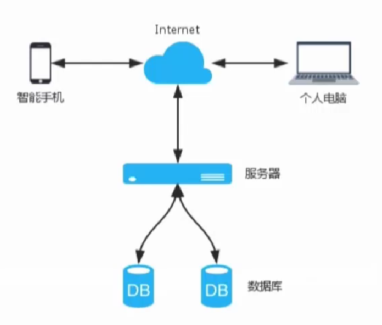
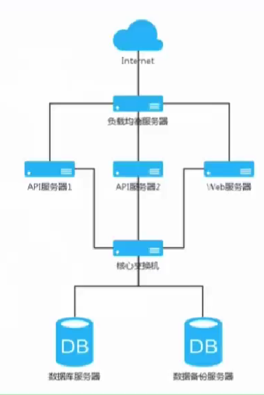

# 产品经理必修的技术课

### 设计产品时需考虑的技术点

- 设计展示数据时适用数据类型种类判断
- 设计产品逻辑时多考虑异常流程
- 设计产品模块时考虑程序模块的复用

### Android及ios技术特点及应用

### 网页技术基础

- html是框架，css是给html页面装饰的衣服
- web页面可试效对pc浏览器和手机浏览器的适配

- 很多app都是html5与native混合实现功能的

- 多了解不同生态中有那些自带的控件，可以用现成的控件会极大的方便研发和提高速度

### 服务器端技术了解

- 一个完整的产品分为前端和后端（也就是服务器端），当一个后端需要兼任多个前端应用时则需要产品经理与后端工程师考虑全面与紧密配合

- 后端主要负责处理业务逻辑并精细数据储存

- 客户端（手机、电脑等）→服务器→数据库（DB）
  

- 负载均衡简单架构图

  

- 常用数据的传输形式：json、xml

  

- 客户端与服务器的简单数据交互模型

### 技术型的PRD文档

- 产品经理技术型文档与非技术型文档对比

- 交互设计环节采用技术化术语来明确表达交互动作
- 动态参数采用数据库对应字段来标记
- 用“代码”来表达产品逻辑

